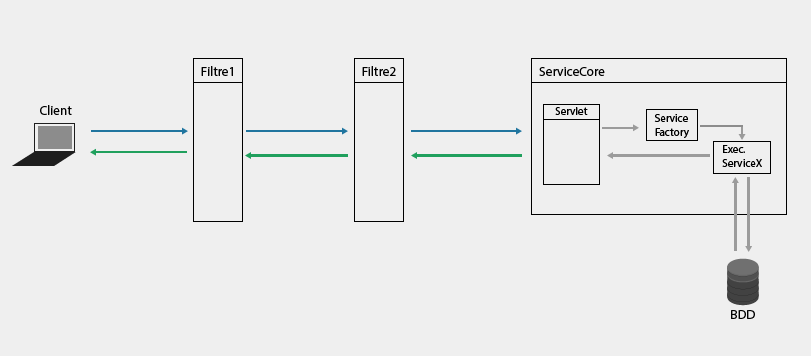

# Quoi De Neuf ?
- Projet Long BDD 2015/2016.
- Binôme : Alexandre VASTRA, Zakaria ZEMMIRI.
- Description : _KoiDe9_ est un système de messagerie WEB permettant aux utilisateurs de s’envoyer des messages et des photos.


## Synopsis :
Un utilisateur doit s'inscrire afin de pouvoir utiliser l'application. Après inscription il dispose :
- D'un avatar par défaut qu'il peut changer ultérieurement.
- De groupes par défaut : Amis, Famille, Pro et Autre.

*Dès lors, l'utilisateur peut* :
 - Personnaliser son profil.
 - Rechercher/Ajouter des nouveaux contacts.
 - Consulter le profil des autres utilisateurs et voir.
 - Ajouter un utilisateur à un ou plusieurs groupes.
 - Créer/Supprimer des groupes d’utilisateurs.
 - Envoyer des messages ou des photos aux contacts ou aux groupes.
 - Visualiser les anciens messages déjà envoyés à un contact ou groupe.


## Installation
  1. Copier le fichier KoiDe9.war dans le dossier webapps de Tomcat.
  2. Configurer l'acces à la base de données dans le fichier META-INF/context.xml.
  3. Lancer tomcat.
  4. lancer l'application : http://localhost:8080/KoiDe9/

## Librairies utilisées :
  - jQuery : pour les appels Ajax, et autre manipulations du DOM.
  - Log4j : pour la génération de logs sur la sortie standard et dans un fichier.
  - JSTL : pour plus de simplicité d'écriture dans les jsp.
  - Bootstap.

## Sécurité & Infos :
 1. Protection contre les injections SQL (PreparedStatement).
 2. Protection contre les injections XSS.
 3. Vérification des données envoyées cotés client et serveur.
 4. Filtre pour limiter l'accès aux pages privées.
 5. Log de toute activité : Adresse IP, port, date, etc.….  
 6. Hashage des mots de passes.

## Architecture :


L'application est construite selon le pattern MVC. Avec deux parties distinctes client (front-end) et serveur (contient l'ensemble des services disponibles).
Chaque partie est construite selon un ou plusieurs patterns pour facilite le développement et la maintenance.
Les deux parties communiquent en utilisant un protocole ad ‘hoc écrit en JSon à mi-chemin entre celui des communications REST et l'enveloppe SOAP.

-> La communication avec les services se fait donc via des requêtes HTTP, avec un format prédéfini.

Format de communication :
- Requête : ```{nomService : "NomDuService",  data : {} }```
- Réponse : ```{returnCode : 0, message : "", data : [] }```

Détail Format Requête :
```
nomService : celui qui est le servicefactory.
data : données envoyées au services.
```
Détail Format Réponse :
```
Codes Retour :
-------------
0 : OK : Tout s'est bien passé.
4 : Warning : une remarque ou une notification sur le contenu de la réponse.
8 : Error : un problème s'est produit.

Message : Permet de donner des informations complémentaires sur le code retour.
data : contient les véritables données envoyées par le service.
```

Une requête client passe par deux filtres :
- Le premier filtre vérifie si l'utilisateur dispose des droit d'accès à la page demandée. si l'utilisateur est connecté la requête est autorisée a passée sinon elle est bloquée et l'utilisateur se voit diriger vers la page de connexion.
- Le deuxième filtre permet de vérifier la validité de la requête. Une requête valide doit respecter le format du protocole précédemment détaillé. Si ce format n'est pas respecté, la requête est bloquée et une réponse est envoyée au client lui indiquant la nature du problème.

Une autre vérification est réalisée au niveau du service. Elle permet de vérifier si le client a bien envoyé les données requises à l'exécution du service et aussi dans le bon format, si ce n'est pas le cas, la requête est bloquée et une réponse est envoyée au client lui indiquant la nature du problème.

La servlet agit comme un « contrôleur ». Il permet la redirection de la requête vers le bon service, mais aussi l'envoie de la réponse au client.


Remarque : Toute données est vérifié en plus sur le client avant envoie au serveur.


- ### Les services :


- ### Coté Serveur :
Il fallait faire un choix sur l'architecture de l'application.
Avantages :
- Tous les appels service se font vers une seule et unique url. Et c'est le contrôleur qui sélectionne le bon service.

- ### Coté Client :
Le client ne dispose que deux taches :
- appeler les services dont il a besoin.
- faire la mapping entre la réponse du service et l'IHM.
