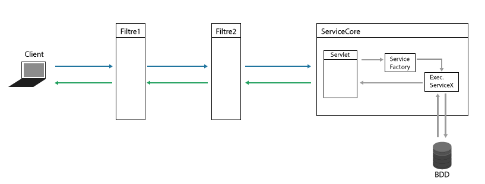

# Quoi De Neuf ?
- Projet Long BDD 2015/2016.
- Binôme : Alexandre VASTRA, Zakaria ZEMMIRI.
- Description : _KoiDe9_ est un système de messagerie WEB permettant aux utilisateurs de s’envoyer des messages et des photos.


## Synopsis :
Un utilisateur doit s'inscrire afin de pouvoir utiliser l'application. Après inscription il dispose :
- D'un avatar par defaut qu'il peut changer ulteriemerement.
- De groupes par defaut : Amis, Famille, Pro et Autre.

*Dès lors, l'utilisateur peut* :
 - Personnaliser son profil.
 - Rechercher/Ajouter des nouveaux contacts.
 - Consulter le profil des autres utilisateurs et voir.
 - Ajouter un utilisateur à un ou plusieurs groupes.
 - Créer/Supprimer des groupes d’utilsateurs.
 - Envoyer des messages ou des photos aux contacts ou aux groupes.
 - Visualiser les anciens messages déjà envoyés à un contact ou groupe.


## Installation
  1. Copier le ficher KoiDe9.war dans le dossier webapps de Tomcat.
  2. Configurer l'acces à la base de données dans le fichier META-INF/context.xml.
  3. Lancer tomcat.
  4. lancer l'application : http://localhost:8080/KoiDe9/

## Librairies utilisées :
  - jQuery : pour les appels ajax, et autre manipulations du DOM.
  - Log4j : pour la génération de logs sur la sortie standard et dans un fichier.
  - JSTL : pour plus de simplicité d'ecriture dans les jsp.


## Securtité & Infos :
 1. Protection contre les injections SQL (PreparedStatement).
 2. Protection contere les injections XSS.
 3. Verification des données envoyées cotés client et serveur.
 4. Filtre pour limiter l'accès aux pages privées.
 5. Log de toute activité : Adresse IP, port, date, etc... .  

## Architecture :


L'application est construite selon le pattern MVC. Avec deux parties distinctes client (front-end) et serveur (contient l'ensemble des services disponibles).
chaque partie est contruite selon un ou plusieurs pattern pour facilite le developpement et la maintenance.
Les deux parties communiquent en utilisant un protocole ad'hoc ecrit en JSon à mis chemin entre celui des communications REST et l'enveloppe SOAP.

-> La communication avec les services se fait donc via des Requetes HTTP, avec un format predefini.

Format de communication :
- Requete : ```{nomService : "NomDuService",  data : {} }```
- Reponse : ```{returnCode : 0, message : "", data : [] }```

Détail Format Requete :
```
nomService : celui qui est le servicefactory.
data : données envoyées au serivces.
```
Détail Format Reponse :
```
Codes Retour:
-------------
0 : OK : Tout s'est bien passé.
4 : Warning : une remarque ou une notification sur le contenu de la reponse.
8 : Error : un probleme s'est produit.

Message: Permet de donner des informations complementaire sur le code retour.
data : contient les veritables données envoyées par le service.
```

Une requete client passe par deux filtres :
- Le premier filtre verifie si l'utilisateur dispose des droit d'acces à la page demandée. si l'utilisateur est connecté la requete est autorisée a passée sinon elle est bloquée et l'utilisateur se voit diriger vers la page de connexion.
- Le deuxieme filtre permet de verifier la validite de la requete. une requete valide doit respecter le format du protocole precedement detaillé. si ce format n'est pas respecté, la requete est bloquée et une reponse est envoyée au client lui indiquant la nature du probleme.

Une autre verification est realisée au niveau du service. elle permet de verifier si le client a bien envoyées les données requises à l'execution du service et aussi dans le bon format, si ce n'est pas le cas, la requete est bloquée et une reponse est envoyée au client lui indiquant la nature du probleme.

La servlet agit comme un "controlleur".Il permet la redirection de la requete vers le bon service, mais aussi l'envoie de la reponse au client.

Le clint ne dispose que deux taches :
- appeler les services dont il a besoin.
- faire la mapping entre la reponse du service et l'IHM.

Remarque : Toute données est verifié en plus sur le client avant envoie au serveur.


- ### Les services :


- ### Coté Serveur :
Il fallait faire un choix sur l'achitecture de l'application.
Avantages :
- Tous les appels service se font vers une seule et unique url. Et c'est le controlleur qui selectionne le bon service.


- ### Coté Client :
Il fallait faire un choix sur l'achitecture de l'application.
